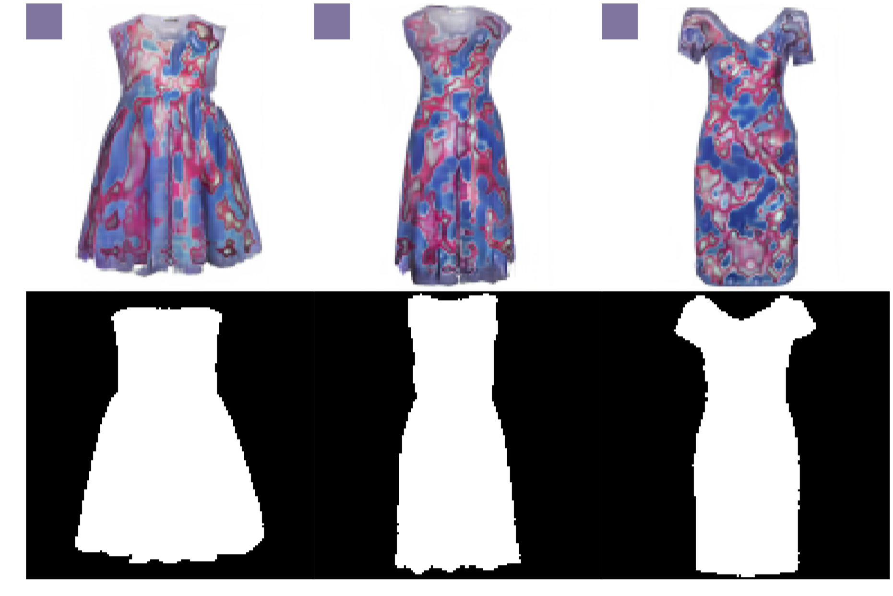

# Disentangling Multiple Conditional Inputs in GANs

This is a Tensorflow implementation of our paper "Disentangling Multiple Conditional Inputs in GANs". It is tested with Tensorflow 1.8 (Python 3.6). We modified the code from [Progressive Growing of GANs for Improved Quality, Stability, and Variation](https://github.com/tkarras/progressive_growing_of_gans) and used it without progressive growing.

## Overview

The process of fashion design requires extensive amount of knowledge in creation and production of garments. A machine-assisted design approach that combines human experience with deep learning can help designers to rapidly visualize an original garment and can save time on design iteration cycles. 

In this paper, we propose a method that disentangles the effects of multiple input conditions in Generative Adversarial Networks (GANs). In particular, we demonstrate our method in controlling color, texture, and shape of a generated garment image for computer-aided fashion design. Please check our paper at [temp_link](temp_link). The flowchart of our method is as follows:

<p align="center"></p>

## Dataset Creation

Before running the code, please check `dataset_tool.py` and `dataset.py` files and make sure that you modify them for your purposes. Creating and loading the dataset will depend on the task.

In `dataset_tool.py`, you can check how we created an image dataset along with color labels:

[Loading color labels](https://github.com/zalandoresearch/disentangling_conditional_gans/blob/master/dataset_tool.py#L616)

[Adding images and labels](https://github.com/zalandoresearch/disentangling_conditional_gans/blob/master/dataset_tool.py#L622)

In `dataset.py`, you can check how we load our dataset as follows:

[Real images](https://github.com/zalandoresearch/disentangling_conditional_gans/blob/master/dataset.py#L68)

[Real masks](https://github.com/zalandoresearch/disentangling_conditional_gans/blob/master/dataset.py#L78)

[Real color labels](https://github.com/zalandoresearch/disentangling_conditional_gans/blob/master/dataset.py#L89)

## Training

You can adjust the training parameters by modifying the `config.py` file. After that, the training can be performed by running the following code:

```
python train.py
```

## Examples

#### Color Control


#### Texture Control


#### Shape Control

